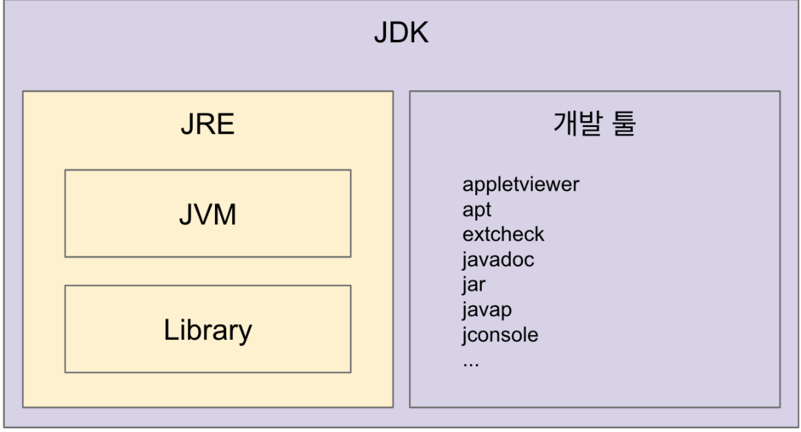
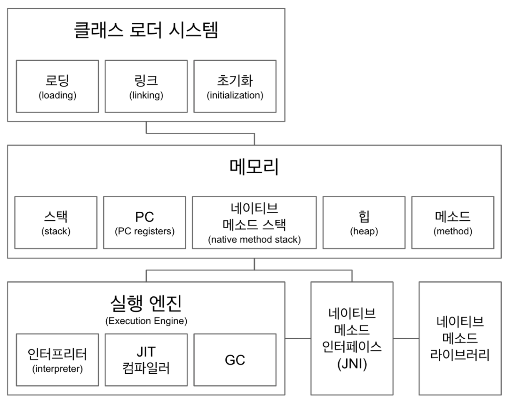
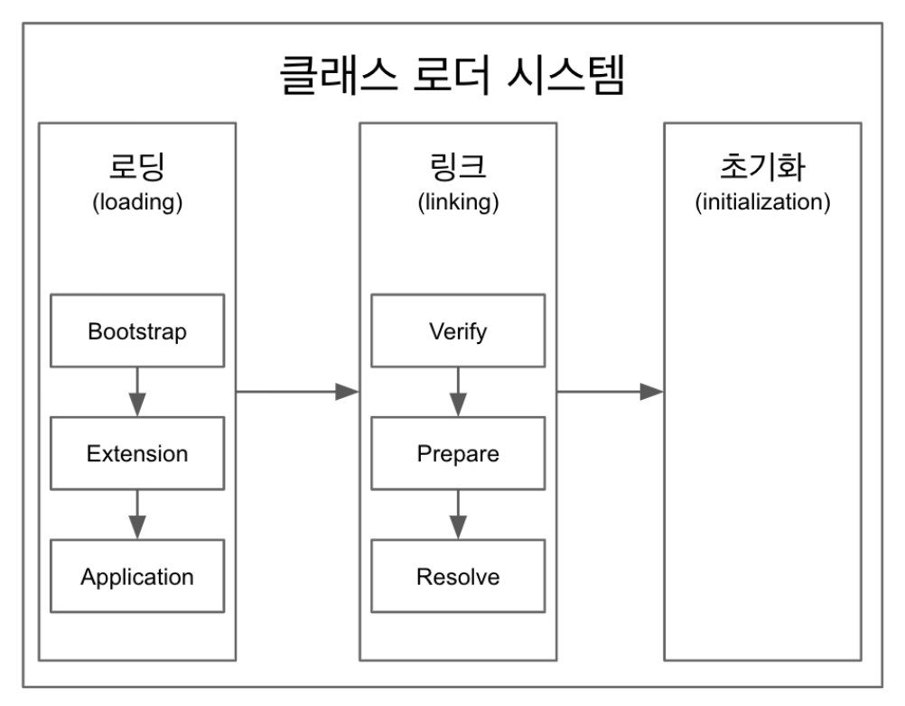
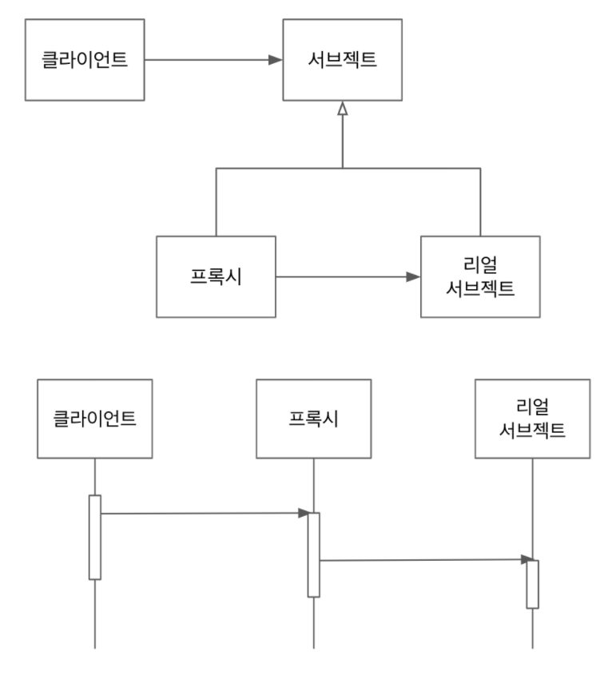

# Java 코드를 조작하는 다양한방법

## JVM 이해하기

### 1. 자바, JVM, JDK, JRE



JVM (Java Virtual Machine)  
- 자바 가상 머신으로 자바 바이트 코드(.class 파일)를 OS에 특화된 코드로 변환(인터프리터와 JIT 컴파일러)하여 실행한다.
- 바이트 코드를 실행하는 표준(JVM 자체는 표준)이자 구현체(특정 밴더가 구현한 JVM)다.
- JVM 밴더: 오라클, 아마존, Azul, ...
- 특정 플랫폼에 종속적.

JRE (Java Runtime Environment): JVM + 라이브러리
- 자바 애플리케이션을 실행할 수 있도록 구성된 배포판.
- JVM과 핵심 라이브러리 및 자바 런타임 환경에서 사용하는 프로퍼티 세팅이나 리소스 파일을 가지고 있다.
- 개발 관련 도구는 포함하지 않는다. (그건 JDK에서 제공)

JDK (Java Development Kit): JRE + 개발 툴
- JRE + 개발에 필요할 툴
- 소스 코드를 작성할 때 사용하는 자바 언어는 플랫폼에 독립적.
- 오라클은 자바 11부터는 JDK만 제공하며 JRE를 따로 제공하지 않는다.
- Write Once Run Anywhere

자바
- 프로그래밍 언어
- JDK에 들어있는 자바 컴파일러(javac)를 사용하여 바이트코드(.class 파일)로 컴파일 할 수 있다.
- 자바 유료화? 오라클에서 만든 Oracle JDK 11 버전부터 상용으로 사용할 때 유료.

JVM 언어
- JVM 기반으로 동작하는 프로그래밍 언어
- 클로저, 그루비, JRuby, Jython, Kotlin, Scala, ...

***
###  2. JVM 구조



클래스 로더 시스템
- .class 에서 바이트코드를 읽고 메모리에 저장
- 로딩 : 클래스 읽어오는 과정
- 링크 : 레퍼런스를 연결하는 과정
- 초기화 : static 값들 초기화 및 변수에 할당

메모리
- 메소드 영역 : 클래스 멤버 변수, 메소드 정보, Type(Class or interface)정보, Constant Pool, static, final 변수 등이 생성된다.  
  상수 풀은 모든 Symbolic Refernce를 포함, 공유 자원이다.
- 힙 영역 : 동적으로 생성된 오브젝트와 배열이 저장되는 곳으로 Garbage Collection의 대상이 되는 영역, 공유 자원이다.
- 스택 영역 :  쓰레드 마다 런타임 스택을 만들고, 그 안에 메소드 호출을 스택 프레임이라 부르는 블럭으로 쌓는다.  
  호출된 메서드의 매개변수, 지역변수, 리턴 값 및 연산 시 일어나는 값들을 임시로 저장, 쓰레드 종료하면 런타임 스택도 사라진다.
- PC(Program Counter) 레지스터 : 쓰레드 마다 쓰레드 내 현재 실행할 instruction의 위치를 가리키는 포인터가 생성된다.
- 네이티브 메소드 스택 : 자바외 언어로 작성된 네이티브 코드를 위한 메모리 영역

실행 엔진
- 인터프리터: 바이트 코드를 한줄 씩 실행.
- JIT 컴파일러: 인터프리터 효율을 높이기 위해, 인터프리터가 반복되는 코드를 발견하면 JIT 컴파일러로 반복되는 코드를 모두  
  네이티브 코드로 바꿔둔다. 그 다음부터 인터프리터는 네이티브 코드로 컴파일된 코드를 바로 사용한다.
- GC(Garbage Collector): 더이상 참조되지 않는 객체를 모아서 정리한다.
- JNI(Java Native Interface)
- 자바 애플리케이션에서 C, C++, 어셈블리로 작성된 함수를 사용할 수 있는 방법 제공
- Native 키워드를 사용한 메소드 호출

네이티브 메소드 라이브러리
- C, C++로 작성 된 라이브러리

***
### 3. 클래스 로더



클래스 로더
- 로딩, 링크, 초기화 순으로 진행된다.
- 로딩
  - 클래스 로더가 .class 파일을 읽고 그 내용에 따라 적절한 바이너리 데이터를 만들고 “메소드” 영역에 저장.
  - 이때 메소드 영역에 저장하는 데이터
    - FQCN (Fully Qualified Class Name))
    - 클래스 | 인터페이스 | enum
    - 메소드와 변수
  - 로딩이 끝나면 해당 클래스 타입의 Class 객체를 생성하여 “힙" 영역에 저장.
- 링크
  - Verify, Prepare, Reolve(optional) 세 단계로 나눠져 있다.
  - 검증: .class 파일 형식이 유효한지 체크한다.
  - Preparation: 클래스 변수(static 변수)와 기본값에 필요한 메모리
  - Resolve: 심볼릭 메모리 레퍼런스를 메소드 영역에 있는 실제 레퍼런스로 교체한다.
- 초기화
  - Static 변수의 값을 할당한다. (static 블럭이 있다면 이때 실행된다.)
- 클래스 로더는 계층 구조로 이뤄져 있으면 기본적으로 세가지 클래스 로더가 제공된다.
  - 부트 스트랩 클래스 로더 : JAVA_HOME\lib에 있는 코어 자바 API를 제공한다. 최상위 우선순위를 가진 클래스 로더
  - 플랫폼 클래스로더 : JAVA_HOME\lib\ext 폴더 또는 java.ext.dirs 시스템 변수에 해당하는 위치에 있는 클래스를 읽는다.
  - 애플리케이션 클래스로더 : 애플리케이션 클래스패스(애플리케이션 실행할 때 주는 -classpath 옵션 또는 java.class.path  
    환경 변수의 값에 해당하는 위치)에서 클래스를 읽는다. JAR 파일 안에 있는 Manifest 파일의 Class-Path 속성값으로 지정된   
    폴더에 있는 클래스를 로딩한다.

***  
## 바이트 코드 조작

### 1. Jacoco plugin 을 사용하여 코드 커버리지 측정  
Java code coverage의 약자로 junit 테스트의 결과를 바탕으로 커버리지를 결과를 리포트 해주는 툴

``` shell
$ mvn clean verify
```

pom.xml
```xml
<build>
  <plugins>
    <!-- mvn test 실행하기 위해선 추가해야함 -->
    <plugin>
      <artifactId>maven-surefire-plugin</artifactId>
      <version>2.22.0</version>
    </plugin>
    <plugin>
      <groupId>org.jacoco</groupId>
      <artifactId>jacoco-maven-plugin</artifactId>
      <version>0.8.4</version>
      <executions>
        <execution>
          <goals>
            <goal>prepare-agent</goal>
          </goals>
        </execution>
        <execution>
          <id>report</id>
          <phase>prepare-package</phase>
          <goals>
            <goal>report</goal>
          </goals>
        </execution>
        <execution>
          <id>jacoco-check</id>
          <goals>
            <goal>check</goal>
          </goals>
          <configuration>
            <rules>
              <rule>
                <element>PACKAGE</element>
                <limits>
                  <limit>
                    <counter>LINE</counter>
                    <value>COVEREDRATIO</value>
                    <minimum>0.30</minimum><!-- 코드 커버리지 통과 비율을 설정 -->
                  </limit>
                </limits>
              </rule>
            </rules>
          </configuration>
        </execution>
      </executions>
    </plugin>
  </plugins>
</build>
```

***
### 2. 바이트 코드 조작 라이브러리
- ASM: https://asm.ow2.io/
- Javassist: https://www.javassist.org/
- ByteBuddy: https://bytebuddy.net/#/

```xml
<!-- https://mvnrepository.com/artifact/net.bytebuddy/byte-buddy -->
<dependency>
    <groupId>net.bytebuddy</groupId>
    <artifactId>byte-buddy</artifactId>
    <version>1.11.13</version>
</dependency>
```

```java
public class Moja {
  public String pullOut() throws IOException {
    new ByteBuddy().redefine(Moja.class)
        .method(named("pullOut")).intercept(FixedValue.value("Rabbit!"))
        .make().saveIn(new File("{프로젝트 경로}/target/classes/"));
    return "";
  }
}

public class App {
  public static void main(String[] args) {
    System.out.println(new Moja().pullOut());
  }
}
```
***
### 3. Javaagent 사용하기  
public static void premain, maven-jar-plugin 를 이용하여 jar 생성 후에  
VM 옵션으로 javaagent 값을 해당 jar 경로로 추가하면 바이트코드 조작가능

```xml
<plugin>
  <groupId>org.apache.maven.plugins</groupId>
  <artifactId>maven-jar-plugin</artifactId>
  <version>3.1.2</version>
  <configuration>
    <archive>
      <index>true</index>
      <manifest>
        <addClasspath>true</addClasspath>
      </manifest>
      <manifestEntries>
        <mode>development</mode>
        <url>${project.url}</url>
        <key>value</key>
        <Premain-Class>com.ask.thejavamanipulate.agent.Agent</Premain-Class>
        <Can-Redefine-Classes>true</Can-Redefine-Classes>
        <Can-Retransform-Classes>true</Can-Retransform-Classes>
      </manifestEntries>
    </archive>
  </configuration>
</plugin>
```

```java
public class Agent {

  public static void premain(String agentArgs, Instrumentation inst) {
    new AgentBuilder.Default()
        .type(ElementMatchers.any())
        .transform((builder, typeDescription, classLoader, javaModule) -> builder.method(named("pullOutAgent"))
            .intercept(FixedValue.value("Rabbit!"))).installOn(inst);
  }

}
```

VM 옵션에 추가
```shell
-javaagent:{프로젝트 경로}/target/the-java-manipulate-1.0-SNAPSHOT.jar
```

***
### 4. 바이트코드 조작 정리
프로그램 분석
- 코드에서 버그 찾는 툴
- 코드 복잡도 계산

클래스 파일 생성
- 프록시
- 특정 API 호출 접근 제한
- 스칼라 같은 언어의 컴파일러  

그밖에도 자바 소스 코드 건리지 않고 코드 변경이 필요한 여러 경우에 사용할 수 있다.
- 프로파일러 (newrelic)
- 최적화
- 로깅
- ...

스프링이 컴포넌트 스캔을 하는 방법 (asm)
- 컴포넌트 스캔으로 빈으로 등록할 후보 클래스 정보를 찾는데 사용
- ClassPathScanningCandidateComponentProvider -> SimpleMetadataReader
- ClassReader와 Visitor 사용해서 클래스에 있는 메타 정보를 읽어온다.  
  
ASM, Javassist, ByteBuddy, CGlib

***
## 리플렉션

### 1. 리플렉션 API 클래스 정보 조회  
리플렉션이란 객체를 통해 클래스의 정보를 분석해 내는 프로그램 기법을 말한다.  
애플리케이션의 런타임 동작을 검사하거나 수정할 수 있는 기능이 필요한 프로그램에서 사용된다.

```java
public class App {

  public static void main(String[] args) throws Exception {
    // 클래스를 가져오는 방법1
    Class<Book> bookClass = Book.class;

    // 클래스를 가져오는 방법2
    Class<? extends Book> bookClass2 = book.getClass();

    // 클래스를 가져오는 방법3 FQCN
    Class<?> bookClass3 = Class.forName("com.ask.thejavamanipulate.reflection.Book");

    System.out.println("bookClass = " + bookClass);
    System.out.println("bookClass2 = " + bookClass2);
    System.out.println("bookClass3 = " + bookClass3);
    
    Book book = new Book();

    // 필드 출력 bookClass.getFileds() 사용시 public 만 나옴
    Arrays.stream(bookClass.getDeclaredFields())
        .forEach(System.out::println);

    // 필드 값 출력
    Arrays.stream(bookClass.getDeclaredFields())
        .forEach(f -> {
          try {
            f.setAccessible(true);  // public 이외 접근 가능하게함
            System.out.printf("%s : %s\n", f, f.get(book));
          } catch (IllegalAccessException e) {
            e.printStackTrace();
          }
        });

    // 생성자 출력
    Arrays.stream(bookClass.getDeclaredConstructors())
        .forEach(c -> {
          c.setAccessible(true);
          System.out.printf("%s\n", c);
        });

    // 메서드 출력
    Arrays.stream(bookClass.getDeclaredMethods())
        .forEach(m -> {
          try {
            m.setAccessible(true);
            System.out.printf("%s : %s\n", m, m.invoke(book));
          } catch (InvocationTargetException | IllegalAccessException e) {
            e.printStackTrace();
          }
        });
    
    // 상속, 구현 인터페이스
    System.out.println("bookClass.getSuperclass() = " + bookClass.getSuperclass());
    Arrays.stream(bookClass.getInterfaces()).forEach(i -> System.out.println(i.getName()));

    // 필드 정보 출력
    Arrays.stream(bookClass.getDeclaredFields())
        .forEach(f -> {
          int modifiers = f.getModifiers();
          System.out.println(f);
          System.out.println("isFinal = " + Modifier.isFinal(modifiers));
          System.out.println("isPublic = " + Modifier.isPublic(modifiers));
          System.out.println("isPrivate = " + Modifier.isPrivate(modifiers));
          System.out.println("");
        });
  }
}
```
***
### 2. 애노테이션과 리플렉션  
중요 애노테이션
- @Retention: 해당 애노테이션을 언제까지 유지할 것인가?
  - SOURCE : 소스 코드(.java)까지 남아있는다.
  - CLASS : 클래스 파일(.class)까지 남아있는다.(=바이트 코드), 클래스로더가 해당 클래스를 읽어오면 사라진다.
  - RUNTIME : 런타임까지 남아있는다.
- @Target: 어디에 사용할 수 있는가?
  - TYPE, //class, interface, enum 등에 애노테이션을 지정할 때
  - FIELD, //멤버변수에 애노테이션을 지정할 때
  - METHOD, //메소드에 애노테이션을 지정할 때
  - PARAMETER, //매개변수에 애노테이션을 지정할 때
  - CONSTRUCTOR, //생성자에 애노테이션을 지정할 때
  - LOCAL_VARIABLE, //지역 변수 애노테이션을 지정할 때
  - ANNOTATION_TYPE, //애노테이션타입에 애노테이션을 지정할 때
  - PACKAGE, //패키지에 애노테이션을 지정할 때
  - TYPE_PARAMETER, //매개변수 타입에 애노테이션을 지정할 때
  - TYPE_USE; //타입 사용시에 애노테이션을 지정할 때
- @Inherit: 해당 애노테이션을 하위 클래스까지 전달할 것인가?

```java
@Retention(RetentionPolicy.RUNTIME)
@Target({ElementType.TYPE, ElementType.FIELD})
@Inherited
public @interface BookAnnotation {
  String value();
  String name() default "ask";
  int number() default 100;
}
```

```java
public class App {

  public static void main(String[] args) {

    // 상속받은 (@Inherit) 애노테이션까지 조회
    Arrays.stream(bookClass.getAnnotations()).forEach(System.out::println);
    
    // 자기 자신에만 붙어있는 애노테이션 조회
    Arrays.stream(bookClass.getDeclaredAnnotations()).forEach(System.out::println);
    
    // 어노테이션 정보 출력
    Arrays.stream(bookClass.getAnnotations())
        .peek(annotation -> {
          if (annotation instanceof BookAnnotation) {
            BookAnnotation bookAnnotation = (BookAnnotation) annotation;
            System.out.println("number() = " + bookAnnotation.number());
            System.out.println("name() = " + bookAnnotation.name());
            System.out.println("value() = " + bookAnnotation.value());
          }
        })
        .forEach(System.out::println);
  }
}
```

***
### 3. 리플렉션 API 클래스 정보 수정 또는 실행 
Class 인스턴스 만들기
- 생성자를 통해서 만들어야 한다.
- Constructor.newInstance(params)

필드 값 접근하기/설정하기
- 특정 인스턴스가 가지고 있는 값을 가져오는 것이기 때문에 인스턴스가 필요하다.
- Field.get(object)
- Filed.set(object, value)
- Static 필드를 가져올 때는 object가 없어도 되니까 null을 넘기면 된다.

메소드 실행하기
- Object Method.invoke(object, params)

```java

public class App {

  public static void main(String[] args)
      throws NoSuchMethodException, InvocationTargetException, InstantiationException, IllegalAccessException, NoSuchFieldException {
    Class<Book> bookClass = Book.class;
    
    // 생성자를 통한 객체 생성 1
    Constructor<Book> constructor = bookClass.getConstructor();
    Book book = constructor.newInstance();
    System.out.println("book = " + book);

    // 생성자를 통한 객체 생성 2
    Constructor<Book> constructor2 = bookClass.getConstructor(String.class);
    Book book2 = constructor2.newInstance("myBook");
    System.out.println("book2 = " + book2);
    
    // 필드 조회후 출력
    Field b = Book.class.getDeclaredField("B");
    b.setAccessible(true);
    System.out.println("b = " + b.get(null));
    
    // 필드 값 변경
    b.set(null, "BBBBBBBBB");
    System.out.println("b = " + b.get(null));

    // 메서드 실행 1
    Method g = Book.class.getDeclaredMethod("g");
    g.invoke(book);

    // 메서드 실행 2
    Method sum = Book.class.getDeclaredMethod("sum", int.class, int.class);
    Object invoke = sum.invoke(book, 1, 2);
    System.out.println("sum : " + invoke);
  }
}
```
***
### 4. DI 프레임워크 만들기  
@Inject 라는 애노테이션 만들어서 필드 주입 해주는 컨테이너 서비스 만들기

```java
@Retention(RetentionPolicy.RUNTIME)
@Target(ElementType.FIELD)
public @interface Inject {
}
```
```java
public class ContainerService {

  public static <T> T getObject(Class<T> classType) {
    T instance = createInstance(classType);

    // 인스턴스 생성시 필드에 @Inject 있을 경우 해당 필드의 인스턴스 생성 맟 주입
    Arrays.stream(classType.getDeclaredFields()).forEach(f -> {
      if (f.getAnnotation(Inject.class) != null) {
        Object filedInstance = createInstance(f.getType());
        f.setAccessible(true);

        try {
          f.set(instance, filedInstance);
        } catch (IllegalAccessException e) {
          throw new RuntimeException(e);
        }
      }
    });

    return instance;
  }

  // 인스턴스 생성
  private static <T> T createInstance(Class<T> classType) {
    try {
      return classType.getConstructor().newInstance();
    } catch (InstantiationException | IllegalAccessException | NoSuchMethodException | InvocationTargetException e) {
      throw new RuntimeException(e);
    }
  }

}
```

***
### 5. 리플렉션 정리  
리플렉션 사용시 주의할 것
- 지나친 사용은 성능 이슈를 야기할 수 있다. 반드시 필요한 경우에만 사용할 것
- 컴파일 타임에 확인되지 않고 런타임 시에만 발생하는 문제를 만들 가능성이 있다.
- 접근 지시자를 무시할 수 있다.

스프링
- 의존성 주입
- MVC 뷰에서 넘어온 데이터를 객체에 바인딩 할 때

하이버네이트
- @Entity 클래스에 Setter가 없다면 리플렉션을 사용한다.

***
## 다이나믹 프록시

### 1. 프록시 패턴  


- 프록시와 리얼 서브젝트가 공유하는 인터페이스가 있고, 클라이언트는 해당 인터페이스 타입으로 프록시를 사용한다.
- 클라이언트는 프록시를 거쳐서 리얼 서브젝트를 사용하기 때문에 프록시는 리얼 서브젝트에 대한 접근을 관리거나  
  부가기능을 제공하거나, 리턴값을 변경할 수도 있다.
- 리얼 서브젝트는 자신이 해야 할 일만 하면서(SRP) 프록시를 사용해서 부가적인 기능(접근 제한, 로깅, 트랜잭션, 등)을  
  제공할 때 이런 패턴을 주로 사용한다.

```java
// 컴파일 타임에 프록시가 존재함
public class BookServiceProxy implements BookService {

  private BookService bookService;

  public BookServiceProxy(BookService bookService) {
    this.bookService = bookService;
  }

  @Override
  public void print(Book book) {
    System.out.println("proxy");
    bookService.print(book);
  }
}
```

***
### 2. 다이나믹 프록시  
런타임에 특정 인터페이스들을 구현하는 클래스 또는 인스턴스를 만드는 기술
- 유연한 구조가 아니며 클래스일 경우 프록시 생성 못함
- Object Proxy.newProxyInstance(ClassLoader, Interfaces, InvocationHandler)

```java
// 런타임에 인터페이스 기반 프록시 생성
class BookServiceTest {

  @DisplayName("jdk dynamic proxy 메서드 호출")
  @Test
  void proxy() {
    BookService bookService = (BookService) Proxy.newProxyInstance(BookService.class.getClassLoader(), new Class[]{BookService.class},
        new InvocationHandler() {
          private final BookService bookService = new BookServiceImpl();
          @Override
          public Object invoke(Object proxy, Method method, Object[] args) throws Throwable {
            System.out.println("jdk dynamic proxy");
            return method.invoke(bookService, args);
          }
        });

    bookService.print(new Book("BookName"));
  }
}
```

***
### 3. 클래스의 프록시 생성  
서브 클래스를 만들 수 있는 라이브러리를 사용하여 프록시를 만들 수 있다.
- 상속을 사용하지 못하는 경우 프록시를 만들 수 없다.
  - Private 생성자만 있는 경우
  - Final 클래스인 경우
- 인터페이스가 있을 때는 인터페이스의 프록시를 만들어 사용해야 함


CGlib
- 스프링, 하이버네이트가 사용하는 라이브러리
- 버전 호환성이 좋치 않아서 서로 다른 라이브러리 내부에 내장된 형태로 제공되기도 한다.

```java
class BookServiceTest {

  @DisplayName("CGlib proxy 메서드 호출")
  @Test
  void proxy() {
    MethodInterceptor handler = new MethodInterceptor() {
      private final BookServiceImpl bookServiceImpl = new BookServiceImpl();
      @Override
      public Object intercept(Object o, Method method, Object[] objects, MethodProxy methodProxy) throws Throwable {
        System.out.println("CGlib proxy");
        return method.invoke(bookServiceImpl, objects);
      }
    };

    BookServiceImpl bookServiceImpl = (BookServiceImpl) Enhancer.create(BookServiceImpl.class, handler);
    bookServiceImpl.print(new Book("BookName"));
  }
}
```

ByteBuddy
- 바이트 코드 조작 뿐 아니라 런타임(다이나믹) 프록시를 만들 때도 사용할 수 있다.

```java
class BookServiceTest {
  
  @DisplayName("ByteBuddy proxy 메서드 호출")
  @Test
  void proxy() throws Exception {
    Class<? extends BookServiceImpl> proxyClass = new ByteBuddy().subclass(BookServiceImpl.class)
        .method(any()).intercept(InvocationHandlerAdapter.of(new InvocationHandler() {
          private final BookServiceImpl bookServiceImpl = new BookServiceImpl();

          @Override
          public Object invoke(Object proxy, Method method, Object[] args) throws Throwable {
            System.out.println("ByteBuddy proxy");
            return method.invoke(bookServiceImpl, args);
          }
        }))
        .make().load(BookServiceImpl.class.getClassLoader()).getLoaded();

    BookServiceImpl bookServiceImpl = proxyClass.getConstructor().newInstance();
    bookServiceImpl.print(new Book("BookName"));
  }
}
```

***
### 4. 다이나믹 프록시 정리  
런타임에 인터페이스 또는 클래스의 프록시 인스턴스 또는 클래스를 만들어 사용하는 프로그래밍 기법
- 스프링 데이터 JPA
- 스프링 AOP
- Mockito
- 하이버네이트 lazy initialization
- ...

***
## 애노테이션 프로세서

### 1. Lombok(롬복)  
@Getter, @Setter, @Builder 등의 애노테이션과 애노테이션 프로세서를 제공하여 표준적으로  
작성해야 할 코드, 반복해서 재사용 해야 하는 코드(boilerplate code) 를 개발자 대신 생성해주는 라이브러리.

> IntelliJ lombok 플러그인 설치  
> IntelliJ Annotation Processing 옵션 활성화

pom.xml
```xml
<dependency>
    <groupId>org.projectlombok</groupId>
    <artifactId>lombok</artifactId>
    <version>1.18.8</version>
    <scope>provided</scope>
</dependency>
```

롬복 동작 원리   
컴파일 시점에 애노테이션 프로세서를 사용하여 소스코드의 AST(abstract syntax tree)를 조작한다.

이슈 사항  
- 공개된 API가 아닌 컴파일러 내부 클래스를 사용하여 기존 소스 코드를 조작한다.  
- 특히 이클립스의 경우엔 java agent를 사용하여 컴파일러 클래스까지 조작하여 사용한다.   
  해당 클래스들 역시 공개된 API가 아니다보니 버전 호환성에 문제가 생길 수 있고 언제라도  
  그런 문제가 발생해도 이상하지 않다.
- 그럼에도 불구하고 엄청난 편리함 때문에 널리 쓰이고 있으며 대안이 몇가지 있지만 롬복의 모든 기능과 편의성을 대체하진 못한다.
  - [AutoValue](https://github.com/google/auto/blob/master/value/userguide/index.md)
  - [Immutables](https://immutables.github.io)

***
### 2. 애노테이션 프로세서 정리  
애노테이션 프로세서는 컴파일 시점에 끼어들어 특정한 애노테이션이 붙어있는 소스코드를 참조해서 새로운 소스코드를 만들어 낼 수 있는 기능이다.  
애노테이션이 붙어있는 소스코드의 정보를 트리구조(AST)로 참조한다.  

**동작 순서**
1. 자바 컴파일러가 컴파일을 수행한다.. (자바 컴파일러는 애노테이션 프로세서에 대해 미리 알고 있어야 한다.)
2. 실행되지 않은 애노테이션 프로세서들을 수행합니다. (각각의 프로세서는 모두 각자에 역할에 맞는 구현이 되어있어야한다.)
3. 프로세서 내부에서 애노테이션이 달린 Element(변수, 메소드, 클래스 등)들에 대한 처리를 한다. (보통 이곳에서 자바 클래스를 생성한다.)
4. 컴파일러가 모든 애노테이션 프로세서가 실행되었는지 확인하고, 그렇지 않다면 반복해서 위 작업을 수행합니다.

***
## 마무리  
- VM 구조
- 바이트 코드 조작 - ASM 또는 Javassist, ByteBuddy
- 리플렉션 API - 클래스 정보 참조 (메소드, 필드, 생성자, ...)
- 다이나믹 프록시 기법 - Proxy, CGlib, ByteBuddy
- 애노테이션 프로세서 - AbstractProcessor, Filer, ..., AutoService, Javapoet


